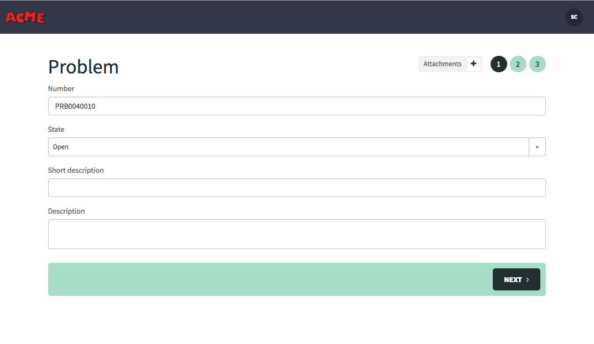

# Introduction

## Instance Preparation


This lab is tested on **Kingston** release of ServiceNow.

1. Make sure **Service Portal** plugin is activated.

That's it! You're now all set to begin the lab!


# Sneak Peak


# Lab 1: The Portal Record
## Goal
In this lab you will learn how to configure portals and customise the theme applied to them.

## Create the Portal
1.	Open your web browser and navigate to the URL of your instance.

2. Login as an administrator (e.g. `admin`).
3.	In the application navigator, search for and open **Portals**
4. Create a new portal called **Acme Corp**.
5. Set **URL Suffix** to  `acme`.
6.	Download **[`acme.png`](resources/lab-1/acme.png)**, upload it to the **Logo** field, and **Save** the portal record.
7. Set **Knowledge Base** to  `IT`.
8. Set **Catalog** to  `Service Catalog`.
9.	Now let us create a new Theme for this portal, click on magnifying glass and click **New**.
10. Update the Theme record to have the values below, then press **Save**:

	| Field         | New Value                                 |
	|---------------|-------------------------------------------|
	| Name        | Acme |
	| Header        | Stock Header *(we will use the OOB header)* |
	
# Lab 2: Cloning and Creating Pages
## Goal
In this lab we will create a login page for our portal, and the home page.

## Cloning Existing Pages
1. In the application navigator, search for **Pages**, and open the result under the **Service Portal** application.

2. Search for and open the page with the **ID** `landing`.
3. Click on the **Clone Page** button (located to the top-right of the form).
4. Change the cloned page's title to **Acme Login**.
5. Copy the new title, and paste it into the **ID** field, and click out of the field.

	When you click out of the field you will notice the value is automatically converted to lowercase, and spaces will be replaced with underscores. This is because the page's ID is used in the URL when accessing it, and URL's are case insensitive and don't support spaces.
6. Press **Update**.
7. Navigate to the **Idea Portal** record again. Update the **Login page** field to point to the newly-cloned `acme_login` page, then save the record.

### Verify the Changes
Open a browser which you're not logged into (or an "incognito" window) and navigate to `/acme` on your instance. You should see the below page.


## Modifying Pages
1. Open the **Acme Login** page (under **Service Portal** ► **Pages**).
	
2. Let's change the background image of the page.

	In the **Page Specific CSS** field, on line **8** you can see the background image hard-coded on this line:

	```
	background-image: url('sp-landing-back.jpg');
	``` 
	Download the new Background image from **[`here`](resources/lab-2/acme-login-bg.jpg)** and upload it to images table.
	
	Go back to **Acme Login** page record and change the image name from `sp-landing-back.jpg` to `acme-login-bg.jpg` and save the record. The line should now look like this:
	
	```
	background-image: url('acme-login-bg.jpg');
	```
	
3. Open the page in **Service Portal Designer** by clicking on the **Open in Designer** link.

4. There are 5 widgets on the page:
	- HTML
	- Login
	- Typeahead Search
	- Popular Questions
	- Language Switch
	
	We don't need the **Typeahead Search**, **Popular Questions**, or **Language Switch** widgets on our page. Remove these from the page by hovering over them, and clicking on the trash/bin icon.
	
	
	
6. Let's edit the text on the page. Hover over the **HTML** widget, and click the pencil icon. The options for this particular instance of the HTML widget will open. Change the heading text to say "*Welcome to the Acme Portal*". Press **Save**.

	
	
	You might be thinking, what are the dollar signs and curly braces around the text doing? These are related to [internationalization](https://docs.servicenow.com/bundle/jakarta-servicenow-platform/page/build/service-portal/concept/c_WidgetLocalization.html). If the user visiting the portal is using another language, this text can be automatically replaced with a translation from the `sys_ui_messages` table.
	

### Verify the Changes

Open a browser which you're not logged into (or an "incognito" window) and navigate to `/ideas` on your instance. You should see the below page.


## Creating Pages
1. Go to pages (under **Service Portal** ► **Pages**), click on New.
	
2. Set **Acme Home** as the **Page title**. The **Page ID** will automatically populate as `acme_home`. Click **Submit**.
3. Every new page has a default container already on it, but we need two. Drag and drop a container below the existing one from the **Layouts** area of the left-hand panel. Your page should now look like this:
	
	
	
	
4. Drag and drop a **12** column layout from the Layouts panel into the first container, and a **3 | 3 | 3 | 3** column layout into the second container.
5. Open the **Acme Portal** record again (under **Service Portal** ► **Portals**).
6. As the **Homepage**, select `acme_home` and press **Save**.

# Lab 3: Add OOB Widgets
## Goal
In this lab we will use OOB widgets to build our pages.

## Homepage Search Widget
1. In page designer for Acme Home page, search for **Homepage Search** widget and drag and drop it into the 12 column layout.

2. Click the pencil icon at the top-right corner of the widget.
3. Lets configure widget options to customize it to our needs. Change the **Title** and **Typeahead Search** fields to below.

	

4. Click on the container enclosing the **Homepage Search** widget. Once on the container, click on the pencil icon on top right corner.
		
		
5. Upload this **[`color-texture.png`](resources/lab-3/color-texture.png)** for the container Background Image and click save.

 
 
6. A note about **Search Sources**

## Icon link Widget
1. In page designer for Acme Home page, search for **Icon Link** widget and drag and drop it into all the 3 column layouts.

2. Click the pencil icon at the top-right corner of the widget.

3. Lets configure widget options for all 4 **Icon Link** widgets. Customize the first widget optins to look like below and click save.
  
 

4. Configure 2nd **Icon Link** to point to **Knowledge Base**

	| Option         | Value                                 |
	|---------------|-------------------------------------------|
	| Type        | Page |
	| Page | kb_view2 |
	| Title | Knowledge Base |
	| Short Description | Browse and search for articles, rate or submit feedback |
	| Bootstrap Color | Success |
	| Template | Top icon |

5. configure 3rd **Icon Link** to a navigate to report a problem 

	| Option         | Value                                 |
	|---------------|-------------------------------------------|
	| Type        | URL |
	| HREF / URL        | `?id=form&table=problem&sys_id=-1&view=mobile` |
	| Title | Report a problem |
	| Short Description | Hit a snag?, please report a problem here |
	| Bootstrap Color | Warning |
	| Template | Top icon |

6. configure 4th **Icon Link** to create an incident.

	| Option         | Value                                 |
	|---------------|-------------------------------------------|
	| Type        | URL |
	| HREF / URL        | `?id=sqa_tagged_questions` |
	| Title | Community |
	| Short Description | Community-sourced answers to your questions |
	| Bootstrap Color | Danger |
	| Template | Top icon |
	
7. Click on the container enclosing the **Icon Link** widgets. Once on the container, click on the pencil icon on top right corner.
8. Set **Parent Class** to `well` and  Save

## Simple List widget
1. Drag and drop a third container below the icon links widget Container.

 
 
2. Drag and drop a **4 | 4 | 4** column layout from the Layouts panel into this container.
3. Search for Simple List widget and drag it onto the first 4 column box.


4. Configure the Options for the simple list widget. 

| Option         | Value                                 |
|---------------|-------------------------------------------|
| Table        | Problem |
| Filter        | `active=true^assigned_toISEMPTY` (Active problems not assigned to anyone) |
| Display Field | short description |
| Secondary Field | Opened By |
| Link to page | form |
| Show even when empty | True |


**DEMO: Of the OOB form widget. Ex: Problem Table, Add couple of sections to Mobile view to make the form more readable.**

## Branding

1. Search for **Service Portal Configuration** in the instance left nav and click on it.
2. Sp Config page should open up in new tab 

	

3. Click on **Branding Editor**
4. Search for **Acme Corp**

	
	
Here, you can change Logo, and theme colors of your portal

| Field         | Value                                 |
|---------------|-------------------------------------------|
| Logo        | **[`Acme Logo`](resources/Branding/acme.png)** |
| Navbar        | #81B5A1 |
| Navbar divider |#293E40 |
| Navbar link color |#293E40 |
| Primary |#68A1AF |
| Success |#8686BC |
| Info |#E5D87C |
| Warning |#E8A679 |
| Danger |#DB8F8F |

## A Communtiy of widgets

1. Please go to **[`Widget Library`](https://sc.service-now.com/snds?state=featured-widgets&featured=true)**
2. Choose the **Multiform** widget
3. Follow the installation steps and import the widget through the Studio
4. Create a new page record again (under **Service Portal** ► **Pages**). Call it **Problem**
5. Drag and drop a **12** column layout
6. Search for **Multiform** widget and drag it onto 12 column layout
7. Click on the pencil Icon to configure the options.
8. As per the instructions Open it in platform


Populate the form with below values and Save

| Field         | Value                                 |
|---------------|-------------------------------------------|
| Table        | Problem |
| View        | Mobile |
| Success Page |Acme Home |


Update the **Icon Link** to point to new page with below options and **Save** it.

| Option         | Value                                 |
|---------------|-------------------------------------------|
| Type        | URL |
| HREF / URL        | `?id=problem&sys_id=-1` |
| Title | Report a problem |
| Short Description | Hit a snag?, please report a problem here |
| Bootstrap Color | Warning |
| Template | Top icon |


Now try the link, your form should look somrthing like this.




